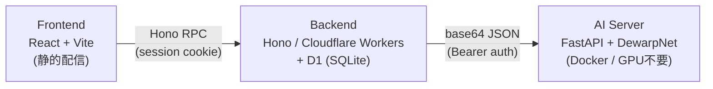

# folio-proto

スマホなどで撮影した書類・本のページの写真を、AI（DewarpNet）でフラットに歪み補正する Web アプリのプロトタイプです。

ユーザー登録・ログインした上で画像をアップロードすると、バックエンド経由で推論サーバーに転送され、補正済み画像が返ってきます。処理はプランごとの月間クォータで制限されます。

## アーキテクチャ



npm workspaces によるモノレポ + Python 推論サーバーの構成です。

| パス | 役割 |
|---|---|
| `packages/shared/` | Zod スキーマと推論型の単一情報源（フレームワーク非依存） |
| `packages/backend/` | Hono API。Cloudflare Workers + D1。認証・クォータ・AI サーバーへの中継 |
| `packages/frontend/` | React + Vite SPA。Hono RPC クライアントでバックエンドと型安全に通信 |
| `ai-server/` | FastAPI + DewarpNet 推論サーバー（Docker） |

## 使用技術

### フロントエンド

- **React 18** + **TypeScript 5.4** + **Vite 5**
- **react-router-dom 6** — ルーティング
- **Hono RPC クライアント**（`hc`）— バックエンドの `AppType` を参照したエンドツーエンドの型安全な通信
- **framer-motion** — アニメーション / **lucide-react** — アイコン
- **heic2any** — HEIC → JPEG のクライアントサイド変換 / **jszip** — ZIP 一括ダウンロード
- **pdf-lib** — PNG を無劣化で埋め込んだ PDF のクライアントサイド生成（ページサイズは画像の縦横比に追従、動的 import）
- JPG 書き出しは `<canvas>` を使ったクライアントサイド再エンコード（透過部分は白背景で塗りつぶし、品質 0.92）

### バックエンド

- **Hono 4** on **Cloudflare Workers**
- **Cloudflare D1**（SQLite）— ユーザー・セッション・使用量クォータの保存
- **Zod 3** + `@hono/zod-validator` — `shared` パッケージのスキーマでリクエスト検証
- **Web Crypto API** — PBKDF2-SHA256（10万イテレーション）によるパスワードハッシュ
- **Wrangler 4** — ローカル開発・デプロイ

### AI サーバー

- **Python 3.11** + **FastAPI** + **uvicorn**
- **PyTorch（CPU 版）** + **[DewarpNet](https://github.com/cvlab-stonybrook/DewarpNet)** — 書類画像の歪み補正モデル（doc3d 学習済み重み）
- **OpenCV** / **Pillow**（pillow-heif で HEIC 対応）
- **Docker** — base（依存 + DewarpNet ソース）/ weights（モデル重み）/ app の3層イメージ構成で差分ビルドを高速化

## セットアップと起動方法

### 必要なもの

- Node.js 22+
- Docker（AI サーバー用）
- Cloudflare アカウント（デプロイ時のみ。ローカル開発は Wrangler のローカル D1 で動作）

### 1. 依存関係のインストール

```bash
npm install   # 必ずリポジトリルートで実行（パッケージ配下で npm install しない）
```

### 2. AI サーバーの準備

学習済み DewarpNet の重み（Git 管理外）を `ai-server/weights/` に配置します。

```
ai-server/weights/unetnc_doc3d_final.pkl    # WC モデル
ai-server/weights/dnetccnl_doc3d_final.pkl  # BM モデル
```

環境変数を設定して Docker で起動します。

```bash
cp ai-server/.env.example ai-server/.env   # API_KEY を設定（空にすると認証無効＝開発用）
make build   # Docker イメージをビルド（base / weights / app の3層。差分のみ再ビルド）
make run     # localhost:8000 で起動
make logs    # ログ確認
```

### 3. バックエンドの環境変数

ローカル開発では `packages/backend/.dev.vars`（Git 管理外）に記述します。

```
AI_ENDPOINT=http://localhost:8000
AI_API_KEY=<ai-server/.env の API_KEY と同じ値>
```

デプロイ環境では Wrangler シークレットとして環境ごとに設定します。

```bash
wrangler secret put AI_ENDPOINT [-e staging]
wrangler secret put AI_API_KEY  [-e staging]
```

### 4. 開発サーバーの起動

```bash
npm run dev:backend    # Hono → http://localhost:8787
npm run dev:frontend   # Vite（/api は 8787 にプロキシされる）
```

AI サーバー（`make run` で port 8000）、バックエンド、フロントエンドの3つが起動していれば、ブラウザで Vite の URL を開いてユーザー登録 → 画像アップロードまで一通り動作します。

## コマンド一覧

```bash
npm run dev:backend    # バックエンド開発サーバー（Wrangler）
npm run dev:frontend   # フロントエンド開発サーバー（Vite）
npm run build          # 全ワークスペースをビルド
npm test               # 全ワークスペースのテストを実行（Vitest。backend は workerd + Miniflare D1 上で実行）
npm run typecheck      # 型チェック（emit なし）
npm run deploy --workspace=@my-app/backend   # Cloudflare Workers へデプロイ

make build     # AI サーバーの Docker イメージをビルド
make run       # コンテナ起動（port 8000）
make deploy    # 停止 → 再ビルド → 起動
make logs      # ログを tail
make clean     # イメージ削除
```

### ai-server のテスト

pytest で実行します。torch は Docker 専用のため venv には入れず、API テストは fake pipeline（`tests/conftest.py` が `inference.pipeline` をスタブ）で動きます。

```bash
python3 -m venv .venv
.venv/bin/pip install -r ai-server/requirements.txt -r ai-server/requirements-dev.txt
cd ai-server && ../.venv/bin/python -m pytest
```

CI では `ci-python` ジョブ（`.github/workflows/deploy.yml`）が PR ごとに同じテストを実行します（デプロイのゲートではありません）。

## API エンドポイント

すべて `/api` 配下。認証はセッション Cookie（HTTP-only、7日で失効）。

### 認証

| メソッド | パス | 説明 |
|---|---|---|
| POST | `/api/auth/register` | ユーザー登録（PBKDF2-SHA256 でハッシュ化） |
| POST | `/api/auth/login` | ログイン（セッション Cookie 発行） |
| POST | `/api/auth/logout` | ログアウト |
| GET | `/api/auth/me` | ログイン中ユーザーの取得 |

### 画像処理（3方式）

| メソッド | パス | 説明 |
|---|---|---|
| POST | `/api/images/process` | シンプルなリクエスト/レスポンス（完了までブロック） |
| POST | `/api/images/process-stream` | SSE で進捗配信（`received → infer → done`） |
| POST | `/api/images/upload` + GET `/api/images/progress` | アップロード（XHR バイト進捗）と SSE 進捗を分離した最も完全な方式（4フェーズ） |
| GET | `/api/images/history` | 処理履歴 |
| GET | `/api/images/usage` | 今月の使用量とクォータ |

## クォータ

| プラン | 上限 |
|---|---|
| `free` | 50 回/月 |
| `pro` | 1000 回/月 |

月は UTC の `YYYY-MM` で管理し、月初の初回利用時に行が作られるため手動リセットは不要です。使用量は推論成功時のみ記録されます（結果のダウンロードをキャンセルしてもクォータは消費されます）。

## フロントエンドの主な機能

- 複数ファイルの一括アップロード（直列処理）と一括ダウンロード（PNG / JPG は ZIP、PDF は複数ページを 1 つの PDF に束ねる）
- 書き出し形式は PNG / PDF / JPG から選択可能（PDF は各画像の縦横比に合わせたページサイズでクライアント側生成、余白は固定24pt。JPG はcanvas経由でPNGから再エンコード、品質0.92）
- 補正前後のビフォー/アフター比較表示
- HEIC 画像はクライアント側で JPEG に変換してからアップロード（Windows やドラッグ&ドロップで MIME タイプが不正確なため、拡張子でも判定）
- 使用量バーによるクォータの可視化

## 制約・注意点

- **AI サーバーは水平スケール不可。** ジョブ状態（キュー・バッファ・進捗）をプロセスメモリに `jobId` で保持しており、未取得ジョブは5分で失効します。スケールさせるには Redis や Durable Objects などの外部状態が必要です。
- 画像の永続保存は未実装（保存方針は検討中）。
- 新機能の開発は必ず `shared のスキーマ定義 → D1 マイグレーション → バックエンド → フロントエンド` の順で行います。詳細な開発規約は [CLAUDE.md](./CLAUDE.md) を参照してください。

## デプロイ方法

| コンポーネント | デプロイ先 |
|---|---|
| バックエンド | Cloudflare Workers + Cloudflare D1。production と staging の2環境（`wrangler.toml` 参照） |
| フロントエンド | 静的ホスティング（Cloudflare Pages、Vercel など） |
| AI サーバー | Docker が動くサーバー（オンプレミス等。CPU 推論のため GPU 不要） |

### バックエンド（Cloudflare Workers）

```bash
cd packages/backend

# 初回のみ: D1 マイグレーションの適用
npx wrangler d1 migrations apply grad-proto-db --remote                # production
npx wrangler d1 migrations apply grad-proto-db-staging --remote -e staging  # staging

# シークレットの設定（環境ごとに必要）
npx wrangler secret put AI_ENDPOINT [-e staging]   # AI サーバーの公開 URL
npx wrangler secret put AI_API_KEY  [-e staging]   # AI サーバーの Bearer トークン

# デプロイ
npm run deploy --workspace=@my-app/backend   # production（ルートから実行可）
npx wrangler deploy --minify src/index.ts -e staging   # staging
```

### フロントエンド（静的ホスティング）

```bash
VITE_API_URL=https://<バックエンドの公開URL> npm run build --workspace=@my-app/frontend
```

`packages/frontend/dist/` を Cloudflare Pages や Vercel にアップロードします。フロントとバックエンドがクロスオリジンになるため、セッション Cookie は HTTPS 必須（`SameSite=None; Secure`）です。

### AI サーバー（Docker）

デプロイ先のサーバーに重みファイルと `ai-server/.env`（`API_KEY` を必ず設定）を用意した上で:

```bash
make deploy   # コンテナ停止 → イメージ再ビルド → 起動（port 8000）
```

イメージは base / weights / app の3層に分かれており、`Dockerfile.base`・`requirements.txt`・重みファイルのハッシュが変わらない限りコード変更時は最上層のみ再ビルドされます。

## ライセンス

[MIT](./LICENSE)
