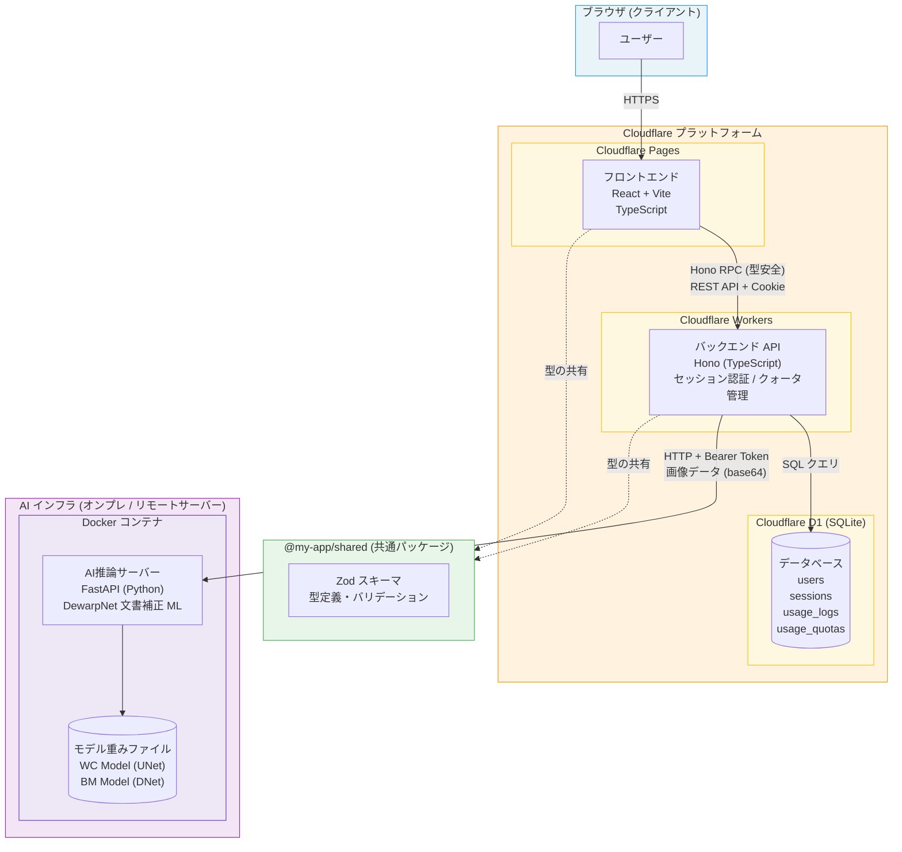
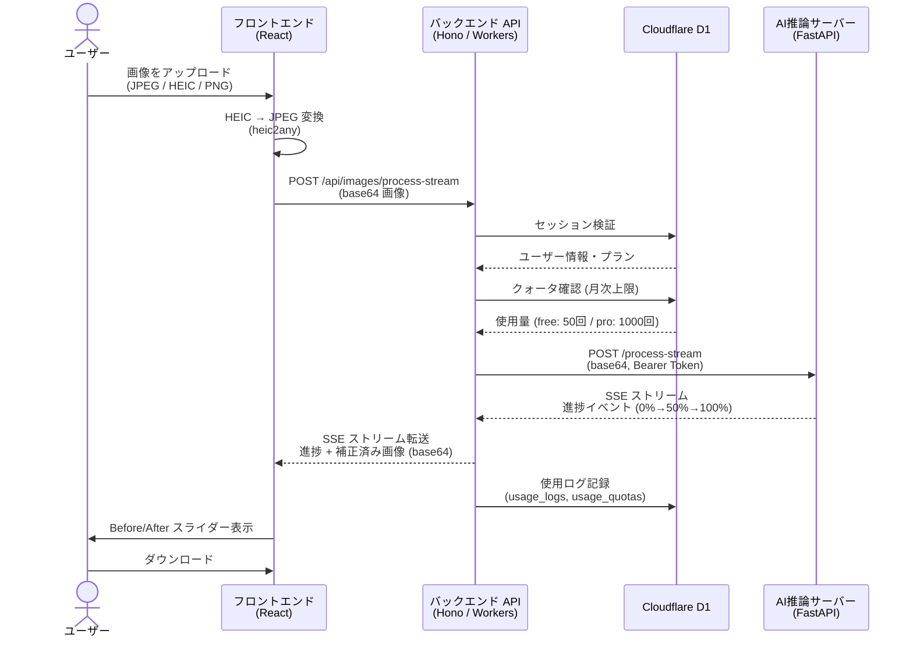
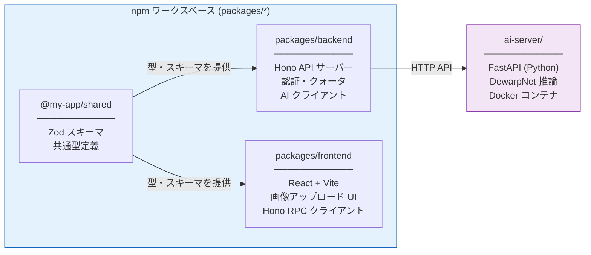
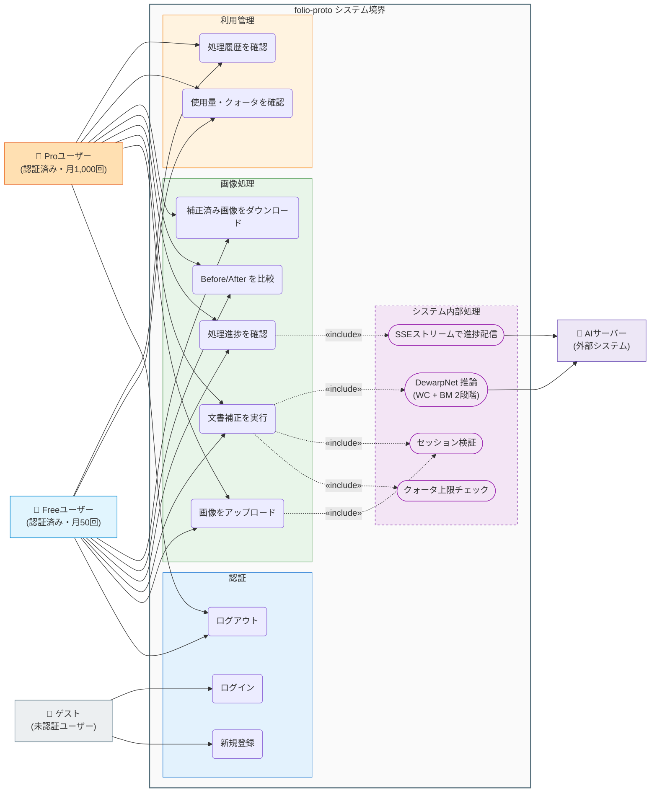
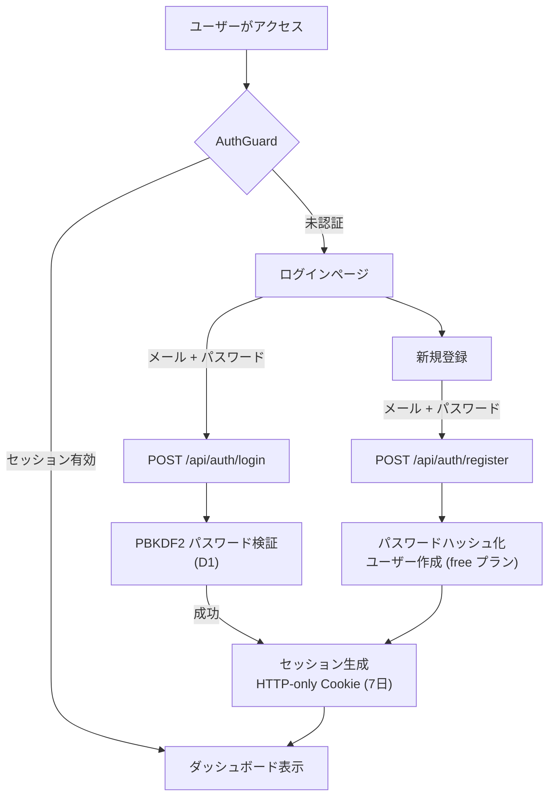

# アーキテクチャ図

## システム全体構成

## データフロー: 画像補正処理

## パッケージ構成

## ユースケース図

**アクター説明:**

| アクター | 説明 | 月間処理上限 |
|---|---|---|
| ゲスト | 未認証ユーザー。登録・ログインのみ可能 | ― |
| Freeユーザー | 無料プラン。基本機能を利用可能 | 50回 |
| Proユーザー | 有料プラン。Freeと同じ機能、上限が大幅拡大 | 1,000回 |
| AIサーバー | DewarpNet推論を担う外部システム | ― |

**ユースケース説明:**

| ユースケース | 説明 |
|---|---|
| 新規登録 | メール・パスワードでアカウント作成 (デフォルト: Freeプラン) |
| ログイン | HTTP-only Cookieによるセッション開始 (7日間有効) |
| ログアウト | セッション破棄 |
| 画像をアップロード | JPEG / PNG / HEIC 形式に対応。HEIC は自動変換 |
| 文書補正を実行 | アップロード画像をDewarpNetで補正。クォータ・セッション確認を含む |
| 処理進捗を確認 | SSEストリームで 0%→50%→100% の進捗をリアルタイム受信 |
| Before/After を比較 | スライダーUIで補正前後を並べて確認 |
| 補正済み画像をダウンロード | 補正済みJPEG画像を端末に保存 |
| 使用量・クォータを確認 | 当月の処理回数・残り回数・プラン上限を表示 |
| 処理履歴を確認 | 直近20件の処理結果 (成功/失敗) を一覧表示 |

## 認証フロー

