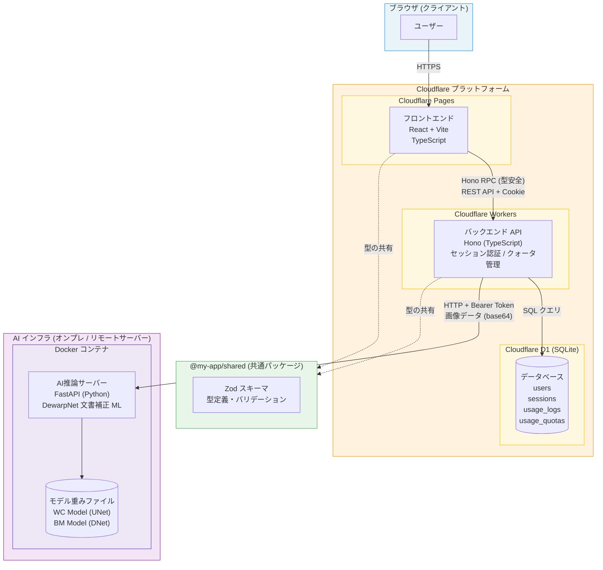
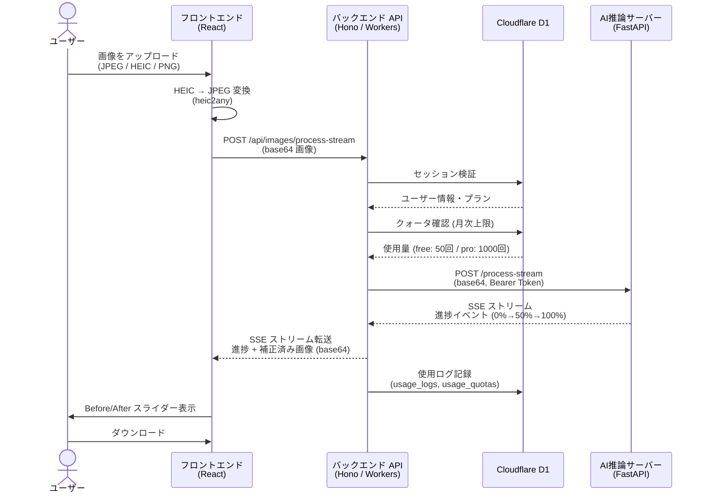
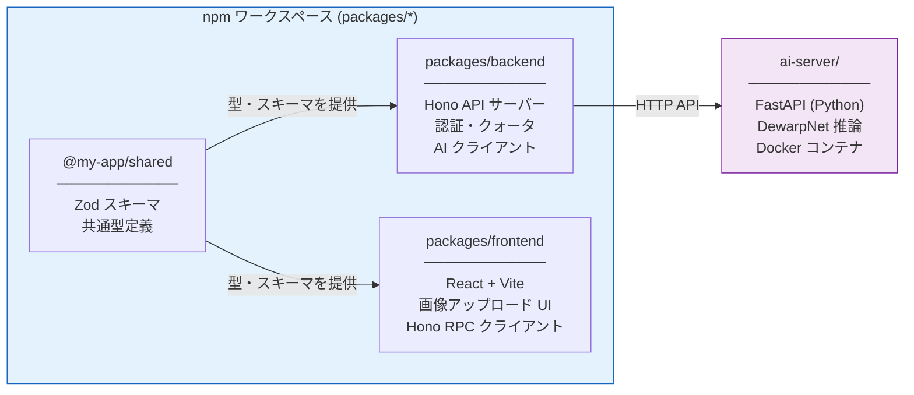
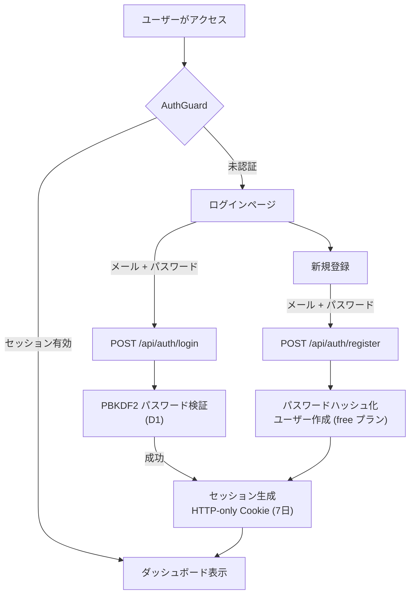

# アーキテクチャ図

## システム全体構成

```mermaid
graph TB
    subgraph Browser["ブラウザ (クライアント)"]
        User["ユーザー"]
    end

    subgraph CF["Cloudflare プラットフォーム"]
        subgraph Pages["Cloudflare Pages"]
            Frontend["フロントエンド<br/>React + Vite<br/>TypeScript"]
        end

        subgraph Workers["Cloudflare Workers"]
            Backend["バックエンド API<br/>Hono (TypeScript)<br/>セッション認証 / クォータ管理"]
        end

        subgraph D1["Cloudflare D1 (SQLite)"]
            DB[("データベース<br/>users<br/>sessions<br/>usage_logs<br/>usage_quotas")]
        end
    end

    subgraph AIInfra["AI インフラ (オンプレ / リモートサーバー)"]
        subgraph Docker["Docker コンテナ"]
            AIServer["AI推論サーバー<br/>FastAPI (Python)<br/>DewarpNet 文書補正 ML"]
            Weights[("モデル重みファイル<br/>WC Model (UNet)<br/>BM Model (DNet)")]
        end
    end

    subgraph Shared["@my-app/shared (共通パッケージ)"]
        Zod["Zod スキーマ<br/>型定義・バリデーション"]
    end

    User -->|"HTTPS"| Frontend
    Frontend -->|"Hono RPC (型安全)<br/>REST API + Cookie"| Backend
    Backend -->|"SQL クエリ"| DB
    Backend -->|"HTTP + Bearer Token<br/>画像データ (base64)"| AIServer
    AIServer --> Weights

    Frontend -.->|"型の共有"| Shared
    Backend -.->|"型の共有"| Shared

    style Browser fill:#e8f4f8,stroke:#2196F3
    style CF fill:#fff3e0,stroke:#FF9800
    style Pages fill:#fff8e1,stroke:#FFC107
    style Workers fill:#fff8e1,stroke:#FFC107
    style D1 fill:#fff8e1,stroke:#FFC107
    style AIInfra fill:#f3e5f5,stroke:#9C27B0
    style Docker fill:#ede7f6,stroke:#673AB7
    style Shared fill:#e8f5e9,stroke:#4CAF50
```

## データフロー: 画像補正処理

```mermaid
sequenceDiagram
    actor User as ユーザー
    participant FE as フロントエンド<br/>(React)
    participant BE as バックエンド API<br/>(Hono / Workers)
    participant D1 as Cloudflare D1
    participant AI as AI推論サーバー<br/>(FastAPI)

    User->>FE: 画像をアップロード<br/>(JPEG / HEIC / PNG)
    FE->>FE: HEIC → JPEG 変換<br/>(heic2any)
    FE->>BE: POST /api/images/process-stream<br/>(base64 画像)

    BE->>D1: セッション検証
    D1-->>BE: ユーザー情報・プラン
    BE->>D1: クォータ確認 (月次上限)
    D1-->>BE: 使用量 (free: 50回 / pro: 1000回)

    BE->>AI: POST /process-stream<br/>(base64, Bearer Token)
    AI-->>BE: SSE ストリーム<br/>進捗イベント (0%→50%→100%)
    BE-->>FE: SSE ストリーム転送<br/>進捗 + 補正済み画像 (base64)

    BE->>D1: 使用ログ記録<br/>(usage_logs, usage_quotas)

    FE->>User: Before/After スライダー表示
    User->>FE: ダウンロード
```

## パッケージ構成

```mermaid
graph LR
    subgraph Monorepo["npm ワークスペース (packages/*)"]
        Shared["@my-app/shared<br/>────────────<br/>Zod スキーマ<br/>共通型定義"]
        Backend["packages/backend<br/>────────────<br/>Hono API サーバー<br/>認証・クォータ<br/>AI クライアント"]
        Frontend["packages/frontend<br/>────────────<br/>React + Vite<br/>画像アップロード UI<br/>Hono RPC クライアント"]
    end

    AIServer["ai-server/<br/>────────────<br/>FastAPI (Python)<br/>DewarpNet 推論<br/>Docker コンテナ"]

    Shared -->|"型・スキーマを提供"| Backend
    Shared -->|"型・スキーマを提供"| Frontend
    Backend -->|"HTTP API"| AIServer

    style Monorepo fill:#e3f2fd,stroke:#1565C0
    style AIServer fill:#f3e5f5,stroke:#7B1FA2
```

## 認証フロー

```mermaid
flowchart TD
    A["ユーザーがアクセス"] --> B{AuthGuard}
    B -->|"セッション有効"| C["ダッシュボード表示"]
    B -->|"未認証"| D["ログインページ"]

    D -->|"メール + パスワード"| E["POST /api/auth/login"]
    E --> F["PBKDF2 パスワード検証<br/>(D1)"]
    F -->|"成功"| G["セッション生成<br/>HTTP-only Cookie (7日)"]
    G --> C

    D --> H["新規登録"]
    H -->|"メール + パスワード"| I["POST /api/auth/register"]
    I --> J["パスワードハッシュ化<br/>ユーザー作成 (free プラン)"]
    J --> G
```
